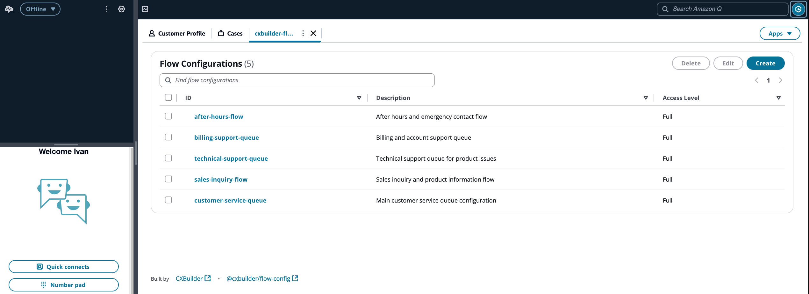

# FlowConfig for Amazon Connect

[](https://github.com/cxbuilder/flow-config/actions/workflows/ci-cd.yml)
[](https://badge.fury.io/js/@cxbuilder%2Fflow-config)
[](https://badge.fury.io/py/cxbuilder-flow-config)
[](https://constructs.dev/packages/@cxbuilder/flow-config)

**Empower your business users to manage Amazon Connect contact flow configurations without IT involvement.**

FlowConfig is a third-party app for Amazon Connect that lets business users update customer messages, queue settings, and routing variables in real-time—without touching contact flows or deploying code.



## The Problem

Your contact center needs to respond quickly to changing conditions:

- 🚨 **Emergency closures** require immediate routing changes
- 🗓️ **Seasonal hours** need frequent prompt updates
- 🌍 **Multi-language support** means managing dozens of message variants
- 🏢 **Multiple locations** each need custom greetings and settings
- ⏱️ **Queue thresholds** must adapt to call volume fluctuations

But every change requires:
- Opening Amazon Connect contact flow designer
- Finding and updating multiple text blocks
- Testing changes
- Deploying updates
- Waiting for IT availability

**There has to be a better way.**

## The Solution

FlowConfig separates **configuration** from **logic**. Your contact flow designers build reusable flows once, and business users manage the values that drive them.

### What You Can Configure

**Variables** - Settings that control contact flow behavior:
- Boolean flags: `closure`, `offerCallback`, `holidayMode`
- Numbers: `maxWaitTime`, `queueDepth`, `transferTimeout`
- Text values: `skillLevel`, `routingMode`, `priority`

**Prompts** - Customer-facing messages:
- Multi-language support (English, Spanish, French, etc.)
- Separate voice and chat content
- Text-to-speech preview before going live

### Who Uses FlowConfig

**👔 Edit Users**
- Update all variables and prompts across all flow configurations
- Change settings during high-volume events or emergencies
- Update prompts for holidays, closures, and special events
- Preview voice messages before customers hear them
- Make changes instantly without IT involvement

**🔧 Administrators (Admin Access)**
- Create and organize flow configurations
- Define variable schema types (Text, Number, Boolean, Select)
- Add/remove variables and prompts
- Set up multi-language prompts for global operations
- Import/export configurations across environments
- Configure application settings (available locales and voices)

**👀 Read-Only Users**
- View all configurations and settings
- Monitor what messages customers are currently hearing
- Review variable values without editing capability

## Quick Links

### 📘 I'm a Business User
- [Edit User Guide](./docs/UserGuide-Edit.md) - Learn how to update variables and prompts
- [Administrator Guide](./docs/UserGuide-Admin.md) - Create and manage configurations
- [Read-Only User Guide](./docs/UserGuide-Read.md) - View configurations

### 🛠️ I'm a Developer/Architect
- [Installation & Deployment](./docs/Installation.md) - Get started deploying FlowConfig
- [Architecture](./docs/Architecture.md) - Understand the technical design
- [Data Model](./docs/DataModel.md) - Explore the data structure

### 🎯 I'm Evaluating This Solution
- [Screenshots](./docs/screenshots/) - See the interface in action
- [Use Cases](#common-use-cases) - Real-world scenarios below
- [Features](#key-features) - What's included

## Common Use Cases

### 🏢 Multi-Branch Operations

**Challenge**: 50 branch offices, each with unique phone numbers and custom greetings, but sharing the same contact flow logic.

**Solution**: Create one flow configuration per branch (e.g., `branch-office-austin`, `branch-office-seattle`). Each branch gets custom prompts and settings while using a single, centralized contact flow design.

**Result**: Onboard new branches in minutes. Local staff can update their own greetings and settings without IT involvement.

---

### 🚨 Emergency Response

**Challenge**: Fire alarm requires immediate call center closure. Every minute of delay means confused customers and wasted agent time.

**Solution**: Business users open FlowConfig, toggle `closure: true`, and save. All new calls immediately hear the closure message and are routed appropriately.

**Result**: Response time measured in seconds, not hours. No contact flow changes, no deployments, no IT tickets.

---

### 🌍 Global Customer Support

**Challenge**: Supporting customers in English, Spanish, and French requires managing hundreds of prompt variants across dozens of contact flows.

**Solution**: Define prompts once in FlowConfig with all language variants. Contact flows automatically select the correct language based on customer preference.

**Result**: Add a new language by updating prompts in FlowConfig—no contact flow changes required.

---

### 📊 Dynamic Queue Management

**Challenge**: Call volume spikes require rapid adjustment of queue thresholds, wait times, and callback offerings.

**Solution**: Business users adjust variables like `maxQueueDepth`, `maxWaitTime`, and `offerCallback` in real-time based on current conditions.

**Result**: Contact center supervisors respond to changing conditions without waiting for IT or risking contact flow mistakes.

---

## Key Features

**For Business Users:**
- ✅ **No-Code Interface** - Simple web UI embedded in Amazon Connect Agent Workspace
- 🎧 **Preview Before Publishing** - Hear exactly how prompts will sound using Amazon Polly text-to-speech
- 🌍 **Multi-Language Support** - Manage prompts in multiple languages with separate voice and chat content
- ⚡ **Instant Updates** - Changes take effect immediately for new customer contacts
- 🔒 **Role-Based Access** - Three access levels: Admin, Edit, and Read-Only

**For IT Teams:**
- 🏗️ **Serverless Architecture** - Built on AWS Lambda, DynamoDB, and API Gateway
- 🔌 **Native Connect Integration** - Seamlessly integrates with contact flows via Lambda function
- 🔐 **Secure by Design** - AWS Cognito authentication with role-based access control
- 📦 **Easy Deployment** - Single CDK construct deploys the entire stack
- 🌐 **Flexible Architecture** - Supports single-region, multi-region, public, or VPC-private deployments
- 📤 **Import/Export** - Move configurations between environments (dev/test/prod)

---

## Getting Started

### For Developers

**Installation:**

```bash
npm install @cxbuilder/flow-config
```

**Basic Usage:**

```typescript
import { FlowConfigStack } from '@cxbuilder/flow-config';
import * as cdk from 'aws-cdk-lib';

const app = new cdk.App();
new FlowConfigStack(app, 'FlowConfigStack', {
  prefix: 'my-flow-config',
  env: { region: 'us-east-1', account: 'YOUR_ACCOUNT_ID' },
  cognito: {
    domain: 'https://your-auth-domain.com',
    userPoolId: 'us-east-1_YourPoolId',
  },
  connectInstanceArn: 'arn:aws:connect:us-east-1:YOUR_ACCOUNT:instance/YOUR_INSTANCE_ID',
  alertEmails: ['admin@yourcompany.com'],
});
```

**Next Steps:**
- See the [Installation Guide](./docs/Installation.md) for detailed deployment instructions
- Review the [Architecture](./docs/Architecture.md) to understand the technical design
- Explore advanced configurations (VPC private, multi-region, etc.)

### For Contact Flow Designers

**Using FlowConfig in Your Contact Flows:**

1. Add an "Invoke AWS Lambda function" block
2. Select the GetConfig Lambda function (automatically deployed)
3. Pass the configuration ID as a parameter:

```json
{
  "id": "main-queue"
}
```

4. Use the returned values in subsequent blocks:
   - Variables: `$.External.closure`, `$.External.maxWaitTime`
   - Prompts: `$.External.welcome`, `$.External.holdMessage`

**Example Flow:**

```
[Entry Point] → [Invoke Lambda: GetConfig with id="main-queue"]
                      ↓
                [Check: $.External.closure = true?]
                      ↓                    ↓
                  [Yes: Play           [No: Continue
                   $.External.          to queue]
                   closureMessage]
```

For detailed Lambda integration instructions, see the [Technical Reference](#technical-reference) below.

---

## Technical Reference

### GetConfig Lambda Integration

The GetConfig Lambda function is used within contact flows to access your flow configs. This function is automatically integrated with your Amazon Connect instance during deployment.

**Lambda Parameters:**

- **Required**: `id` - The flow configuration identifier
- **Optional**: `lang` - Language code (defaults to contact's language or `en-US`)
- **Auto-detected**: `channel` - Voice or chat (detected from contact data)

**Lambda Response:**

Returns a flattened object containing all variables and prompts from the configuration:

```json
{
  "closure": "false",
  "maxWaitTime": "600",
  "offerCallback": "true",
  "welcome": "Thank you for calling...",
  "holdMessage": "Please continue to hold..."
}
```

**Key Behaviors:**

- Automatically selects the correct language variant based on customer preference
- Returns chat-specific content for chat contacts (or strips SSML from voice content)
- Includes all variables as key-value pairs
- 32KB response size limit (Amazon Connect restriction)

**Detailed Documentation:**

For complete API documentation, event structures, and advanced usage, see:
- [Architecture Documentation](./docs/Architecture.md) - Full Lambda integration details
- [Data Model](./docs/DataModel.md) - Configuration structure and schemas

---

## Development

For developers contributing to FlowConfig or customizing the deployment:

**Frontend Development:**

```bash
npm start              # Local dev server
npm run build          # Production build
```

**Lambda Development:**

```bash
npm run build:lambdas  # Bundle Lambda functions
npm run build          # Full build (CDK + Frontend + Lambdas)
```

**Additional Resources:**
- Uses [Lambda PowerTools](https://docs.powertools.aws.dev/lambda/typescript/latest/) for logging
- OpenAPI spec for API Gateway enables client generation in any language
- Frontend built with React and Amazon CloudScape Design System

For detailed development setup, see [Installation Guide](./docs/Installation.md).
