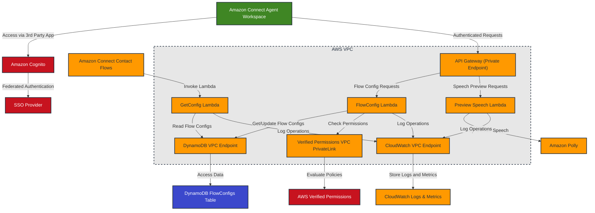

# Amazon Connect Flow Configs - AWS Architecture

## Architecture Diagram

## Architecture Components

### User Interface

- **Amazon Connect Agent Workspace**: Hosts the Flow Configs App as a 3rd Party App
- **React/TypeScript Frontend**: Built with Amazon CloudScape UI framework and Connect theme

### Authentication & Authorization

- **SSO Provider**: Federated with Amazon Connect for single sign-on
- **Amazon Cognito**: Handles user authentication and token generation
- **AWS Verified Permissions**: Manages fine-grained access control based on user tags

### API Layer

- **API Gateway (Private Endpoint)**: Securely exposes APIs within the VPC
- **VPC Endpoints**: Provide secure access to AWS services without internet exposure

### Compute

- **FlowConfig Lambda**: Handles CRUD operations for flow configs
- **Preview Speech Lambda**: Processes text-to-speech requests using Amazon Polly
- **GetConfig Lambda**: Retrieves flow configs for Amazon Connect contact flows

### Data Storage

- **DynamoDB**: Stores flow configs with variables and prompts
- **CloudWatch Logs**: Captures application logs and metrics

### Integration Points

- **Amazon Polly**: Provides text-to-speech capabilities for prompt previews
- **Amazon Connect Contact Flows**: Invoke the GetConfig Lambda to retrieve configuration for contact flow routing and prompts

## Security Considerations

1. **Network Security**:

   - Private API Gateway endpoint not accessible from the internet
   - All AWS service access via VPC endpoints
   - No NAT Gateway required as all traffic stays within AWS network

2. **Authentication**:

   - Federated SSO with Amazon Connect
   - JWT token validation via Cognito authorizers

3. **Authorization**:

   - Fine-grained access control with AWS Verified Permissions
   - Role-based access levels (Full, Edit, Read)
   - Permission evaluation based on user tags and flow config IDs

4. **Data Protection**:
   - DynamoDB table with Point-in-Time Recovery enabled
   - Deletion protection enabled
   - Encrypted data at rest and in transit

## Scalability & Reliability

1. **High Availability**:

   - Lambda functions deployed across multiple Availability Zones
   - DynamoDB global tables for multi-region resilience (optional)

2. **Performance**:

   - DynamoDB on-demand capacity for variable workloads
   - API Gateway caching for frequently accessed flow configs

3. **Monitoring**:
   - CloudWatch metrics and alarms for API usage and errors
   - X-Ray tracing for request flows
   - Comprehensive logging for troubleshooting
