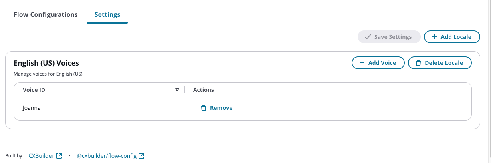
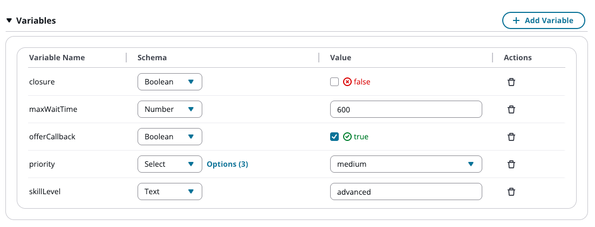
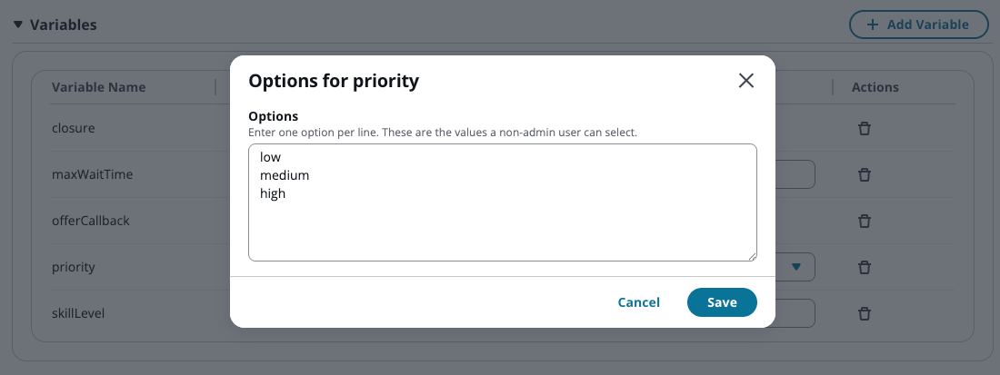

# FlowConfig User Guide - Administrator

This guide is for **administrators** with **Full** access who can create, edit, and delete flow configurations.

## Table of Contents

- [Getting Started](#getting-started)
- [Understanding Flow Configurations](#understanding-flow-configurations)
- [Managing Flow Configurations](#managing-flow-configurations)
  - [Import and Export Configurations](#import-and-export-configurations)
- [Application Settings](#application-settings)
- [Working with Variables](#working-with-variables)
- [Working with Prompts](#working-with-prompts)
- [Integration with Contact Flows](#integration-with-contact-flows)
- [Use Case Example](#use-case-example)

---

## Getting Started

### Accessing FlowConfig

1. Log into the **Amazon Connect Agent Workspace**
2. Click the **Apps** dropdown in the top right
3. Select **FlowConfig** (or your customized app name)


The application opens in a panel showing all flow configurations you have access to.

### Your Access Level

As an administrator with **Full** access, you can:

- **Create** new flow configurations
- **Edit** existing configurations (ID, description, variables, prompts, and schema)
- **Delete** flow configurations
- **Define variable schemas** to control what Edit users can configure

---

## Understanding Flow Configurations

A **Flow Configuration** is a collection of variables and prompts that can be retrieved by Amazon Connect contact flows during customer interactions.

### Key Concepts

- **ID**: Unique identifier used by contact flows to retrieve the configuration
- **Description**: Human-readable description of the configuration's purpose
- **Variables**: Key-value pairs for configurable settings (e.g., `closure: false`, `maxWaitTime: 600`)
- **Variable Schema**: Data type definitions that control how Edit users interact with variables
- **Prompts**: Multi-language, multi-channel text content used for customer communications

### Why Use Flow Configurations?

Flow configurations allow you to:

- Empower business users to change settings without modifying contact flows
- Support multiple languages and channels (voice/chat) from a single configuration
- Reuse one contact flow design across multiple scenarios (e.g., branch offices)
- Reduce IT change requests for simple configuration updates

---

## Managing Flow Configurations

### Creating a Flow Configuration

1. Click the **Create** button in the top right
2. Enter the **ID**
   - This ID must be unique
   - This is what contact flows will use to retrieve the configuration
   - Consider using a hierarchical structure for consistency (e.g., `queue/technical-support`, `branch-office/austin`)
   - IDs can be DNIS numbers (e.g., `+18005551234`) to load configurations based on the dialed number
   - Choose a naming convention that works for your organization and use it consistently
3. Enter a **Description** (e.g., "Technical support queue for product issues")
4. Click **Save Changes** to create the configuration

### Editing a Flow Configuration

1. Click on a flow configuration ID from the list
2. Make your desired changes to variables or prompts
3. Click **Save Changes** to apply
4. Click **Preview** to test voice prompts with Amazon Polly

### Deleting a Flow Configuration

1. Select one or more configurations using the checkboxes
2. Click the **Delete** button
3. Confirm the deletion

**Warning**: Deleting a flow configuration will affect any contact flows that reference it.

### Import and Export Configurations

The import/export feature allows you to move configurations between environments or edit multiple configurations in bulk.


#### Exporting Configurations

1. Select one or more configurations using the checkboxes
2. Click the **More Actions** button
3. Select **Export**
4. A JSON file will be downloaded containing the selected configurations

**Use cases for export:**

- Moving configurations from development to production
- Creating backups of critical configurations
- Bulk editing configurations in your preferred text editor
- Sharing configuration templates with other administrators

#### Importing Configurations

1. Click the **More Actions** button
2. Select **Import**
3. Choose the JSON file to import
4. The configurations will be uploaded

**Important**: Importing overwrites existing entries. If a configuration with the same ID already exists, it will be completely replaced with the imported version.

**Best Practices:**

- Export configurations before importing to create a backup
- Review the JSON file before importing to ensure it contains the expected data
- Use import/export to promote configurations across environments (dev → test → prod)
- Consider keeping exported JSON files in version control for change tracking

---

## Application Settings

The Settings page allows administrators to control which locales and voices are available throughout the application. This ensures users can only select approved locales and use official voices for preview.



### Accessing Settings

1. Click the **Settings** icon (gear icon) in the top right of the application
2. The Settings page opens showing the current locale and voice configuration

### Configuring Locales

Locales define which languages and regional variants are available when creating prompts.

**Why limit locales?**

- Prevents users from selecting unsupported languages
- Ensures consistency across all flow configurations
- Reduces errors from incorrect locale codes
- Aligns with your organization's supported languages

**How to configure:**

1. In the **Locales** section, you'll see a list of configured locales
2. Add or remove locales based on your organization's requirements
3. Each locale includes:
   - **Code**: The locale identifier (e.g., `en-US`, `es-US`, `fr-CA`)
   - **Voices**: The list of Amazon Polly voices available for that locale

### Configuring Voices

For each locale, you can specify which Amazon Polly voices are available for preview.

**Why limit voices?**

- Simplifies the voice selection dropdown for users

**How to configure:**

1. For each locale, specify the allowed Amazon Polly voice IDs
2. Users will only be able to select from these voices when previewing prompts
3. Common voice examples:
   - `en-US`: Joanna, Matthew, Kendra, Stephen
   - `es-US`: Lupe, Pedro, Penelope
   - `fr-CA`: Chantal, Gabrielle

---

## Working with Variables

Variables are key-value pairs that contact flows can use to drive behavior and routing decisions.



### Adding a Variable

1. Click **Add Variable** in the Variables section
2. Enter the **Variable Name** (e.g., `closure`, `maxWaitTime`)
3. Select the **Schema Type** from the dropdown
4. Enter the **Value**
5. The variable is automatically saved

### Variable Schema Types

As an administrator, you define the **schema type** for each variable, which controls how Edit users interact with it:

| Schema Type | Purpose                          | Example Use Case                                 |
| ----------- | -------------------------------- | ------------------------------------------------ |
| **Text**    | Free-form text input             | Skill level, queue name                          |
| **Number**  | Numeric values only              | Wait time, retry count, max queue depth          |
| **Boolean** | True/false toggle                | Feature flags (e.g., `closure`, `offerCallback`) |
| **Select**  | Dropdown with predefined options | Priority levels, routing modes                   |

**Why use schema types?**
Schema types ensure Edit users can only enter valid values. For example, a Boolean prevents typos like "tru" or "flase", and Select ensures users choose from approved options like "low", "medium", "high" rather than entering arbitrary text.

### Configuring Select Options



For **Select** type variables:

1. Choose **Select** from the Schema dropdown
2. Click **Options (0)** next to the schema type
3. Enter one option per line in the modal
4. Click **Save**

Edit users will only be able to choose from these predefined options.

### Removing a Variable

Click the trash icon next to the variable you want to remove.

---

## Working with Prompts

Prompts are text messages played or displayed to customers. FlowConfig allows you to define prompts per language and channel (voice/chat).


### Adding a Prompt

1. Click **Add Prompt** in the Prompts section
2. Enter the **Prompt ID** (e.g., `welcome`, `hold`, `closure`)
3. Click **Add Language** (+ icon) to add a language variant
4. Select the language code (e.g., `en-US`, `es-US`)

### Configuring Prompt Content

For each language:

1. **Voice Content** (required)

   - Enter the text that will be spoken to voice callers
   - SSML tags are supported for enhanced speech synthesis
   - Example: `<speak>Thank you for calling. Please continue to hold.</speak>`

2. **Chat Content** (optional)

   - Enter text specifically for chat customers
   - If left blank, voice content will be used (with SSML tags automatically removed)
   - Use this to customize phrasing for chat (e.g., "Thank you for contacting us" instead of "Thank you for calling")

3. **Preview Voice**
   - Select a voice from the dropdown
   - Click the speaker icon to hear the prompt using Amazon Polly

### Multi-Language Support

Add multiple language variants to support international customers:

1. Click **Add Language** (+)
2. Select language code (e.g., `es-US`, `fr-CA`)
3. Enter content for that language
4. Repeat for each language you support

Contact flows will automatically select the correct language based on the customer's language preference.

### Voice vs. Chat Channels

- **Voice Content**: Played to customers on phone calls (supports SSML)
- **Chat Content**: Displayed to customers in chat (no SSML)

**Best Practice**: Use chat content to adapt messaging for the chat channel. For example:

- Voice: "Thank you for calling XYZ Company"
- Chat: "Thank you for contacting XYZ Company"

### Removing a Prompt or Language

- Click the trash icon next to a prompt to remove it entirely
- Click the trash icon next to a language to remove that language variant

---

## Integration with Contact Flows

### How Contact Flows Use Flow Configurations

Contact flow designers integrate your flow configurations using the **GetConfig Lambda function**, which is automatically deployed with FlowConfig.

### Accessing Variables and Prompts

When a contact flow calls the GetConfig Lambda with a configuration ID:

1. The Lambda retrieves your flow configuration from DynamoDB
2. It returns all variables and prompts as a flat key-value structure
3. The contact flow can then:
   - Use variables for routing decisions (e.g., `if closure = true`)
   - Play prompts to customers (e.g., Play prompt `$.External.welcome`)
   - Set contact attributes for downstream processing

### Example Lambda Call

In the contact flow "Invoke AWS Lambda function" block:

```json
{
  "id": "technical-support-queue"
}
```

The Lambda returns:

```json
{
  "closure": "false",
  "maxWaitTime": "600",
  "offerCallback": "true",
  "priority": "medium",
  "skillLevel": "advanced",
  "hold": "Your call is important to us. Please continue to hold...",
  "welcome": "Thank you for calling technical support..."
}
```

### Size Considerations

- Amazon Connect limits Lambda responses to **32KB**
- The combined size of all variables and prompts should stay under this limit
- For large configurations, consider splitting into multiple flow configs

---

## Use Case Example

### Multi-Branch Office Configuration

**Scenario**: A company has 50 branch offices, each with local phone numbers but sharing the same contact flow design. Each office needs custom welcome prompts and configuration settings.

**Solution**: Create one flow configuration per office using the office code as the ID.

#### Flow Configuration: `branch-office-austin`

**Variables:**

- `maxQueueDepth`: `25`
- `offerCallback`: `true`
- `businessHours`: `8-5`
- `specialtyServices`: `true`

**Prompts:**

**welcome** (en-US):

- Voice: "Thank you for calling the Austin branch. Please hold while we connect you to the next available representative."
- Chat: "Thank you for contacting the Austin branch. We'll connect you with a representative shortly."

**welcome** (es-US):

- Voice: "Gracias por llamar a la sucursal de Austin. Por favor espere mientras lo conectamos con el siguiente representante disponible."
- Chat: "Gracias por contactar la sucursal de Austin. Lo conectaremos con un representante en breve."

**agentWhisper** (en-US):

- Voice: "Incoming call from Austin branch"

#### Contact Flow Integration

The contact flow:

1. Extracts the DNIS (dialed number) or a queue parameter
2. Maps it to the office code (e.g., `austin`)
3. Calls GetConfig Lambda: `{ "id": "branch-office-austin" }`
4. Uses `$.External.maxQueueDepth` for queue management
5. Plays `$.External.welcome` in the customer's language
6. Whispers `$.External.agentWhisper` to the agent

#### Benefits

- **Single contact flow** serves all 50 offices
- **Local customization** without changing the contact flow
- **Easy onboarding**: Clone an existing office config and update prompts
- **Business user empowerment**: Office managers can update their own prompts and settings

---

## Best Practices

1. **ID Naming Convention**: Establish and follow a consistent naming convention
   - Use hierarchical structures for organization (e.g., `queue/technical-support`, `branch/austin/main`)
   - DNIS-based IDs for phone-number-driven routing (e.g., `+18005551234`)
   - Document your naming convention for your team
   - Avoid cryptic abbreviations (e.g., `queue/tech-support` is better than `q1`)
2. **Schema Types**: Always define schema types for variables that Edit users will modify
3. **Test Prompts**: Use the Preview feature to verify voice prompts before saving
4. **Size Management**: Keep configurations under 30KB (combined variables + prompts)
5. **Documentation**: Use descriptive descriptions to help other users understand each config's purpose
6. **Version Control**: Consider keeping a record of major changes to critical configurations

---

## Troubleshooting

### "Configuration not found" in Contact Flow

- Verify the ID in your contact flow matches the configuration ID exactly (case-sensitive)
- Check that the configuration exists and hasn't been deleted

### Variables Not Updating in Contact Flow

- Contact flows may cache Lambda results briefly
- Verify you clicked "Save Changes" after editing
- Test with a fresh contact to ensure changes are retrieved

### Preview Voice Not Working

- Check your network connection
- Verify the prompt contains text (not just SSML tags)
- Try a different voice from the dropdown

---

## Need Help?

- **Technical Issues**: Contact your IT administrator
- **Contact Flow Integration**: Consult with your contact flow designers
- **Access Requests**: Contact your Amazon Connect administrator
