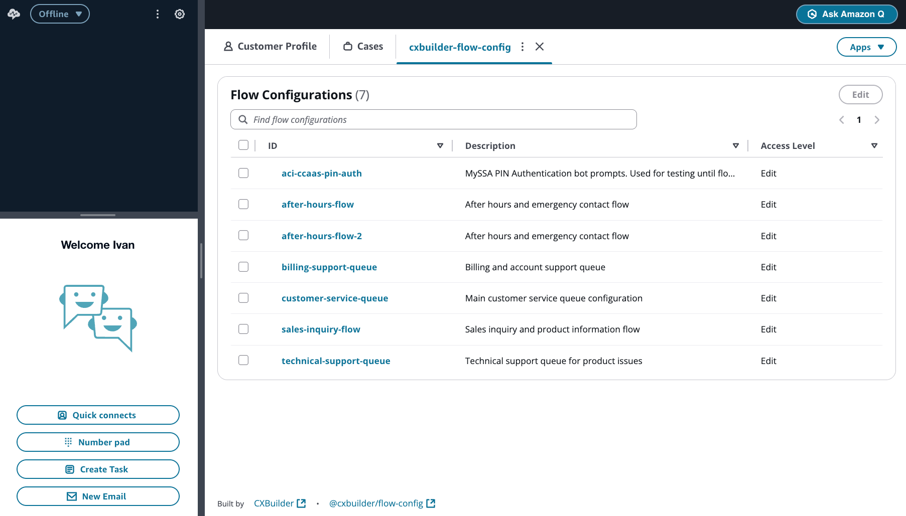
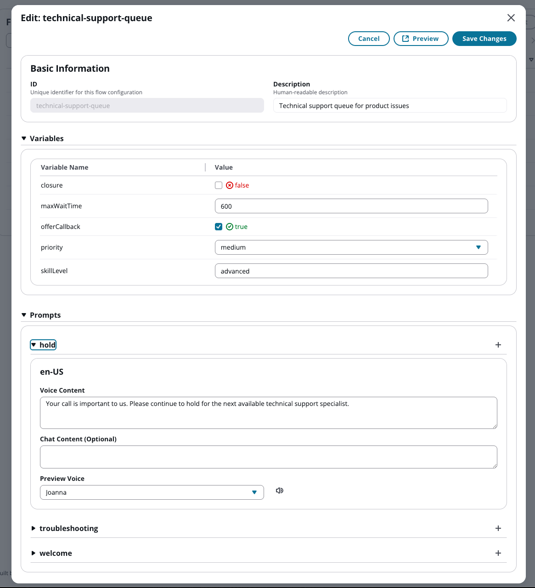

# FlowConfig User Guide - Edit User

This guide is for business users with **Edit** access who can modify variable values and prompt content in existing flow configurations.

## Table of Contents

- [Getting Started](#getting-started)
- [Understanding Your Role](#understanding-your-role)
- [Editing Variables](#editing-variables)
- [Editing Prompts](#editing-prompts)
- [Common Scenarios](#common-scenarios)
- [Best Practices](#best-practices)

---

## Getting Started

### Accessing FlowConfig

1. Log into the **Amazon Connect Agent Workspace**
2. Click the **Apps** dropdown in the top right
3. Select **FlowConfig** (or your customized app name)



The application opens showing all flow configurations in the system.

### Your Access Level

As an **Edit** user, you can:

- **View** all flow configurations
- **Edit variable values** within predefined constraints set by administrators
- **Edit prompt content** for all languages and channels
- **Preview voice prompts** using Amazon Polly

You **cannot**:

- Create new flow configurations
- Delete flow configurations
- Add or remove variables
- Change variable names
- Change variable schema types or options
- Access application settings

---

## Understanding Your Role

### What Are Flow Configurations?

Flow configurations control how Amazon Connect contact flows behave. They contain:

- **Variables**: Settings that affect routing, features, and behavior
- **Prompts**: Messages played or displayed to customers

Your administrators have created these configurations and defined the schema types that control how you interact with variables.

### Why Your Changes Matter

When you update a flow configuration:

- **Changes take effect immediately** for new customer contacts
- **No IT involvement required** for approved changes
- **Business agility** - respond quickly to changing needs

**Example**: During a fire alarm, you can immediately set `closure: true` to route all calls to a closure message, then set it back to `false` when operations resume.

---

## Editing Variables

Variables control contact flow behavior. Administrators have defined the **schema type** for each variable, which determines how you interact with it.


### Variable Types

#### Text Variables

Simple text input for values like queue names or skill levels.

**Example**: `skillLevel`
- Current value: `advanced`
- You can change it to any text value
- Common uses: skill assignments, routing categories

#### Number Variables

Numeric input for values like wait times or queue depths.

**Example**: `maxWaitTime`
- Current value: `600`
- You can only enter numbers
- Common uses: timeout values, queue limits, retry counts

#### Boolean Variables

True/false toggle for feature flags and on/off settings.

**Example**: `closure`, `offerCallback`
- Current value: Checkbox (checked = true, unchecked = false)
- Click to toggle between true and false
- Common uses: feature flags, emergency closures, service availability

#### Select Variables

Dropdown with predefined options set by administrators.

**Example**: `priority`
- Current value: `medium`
- Click dropdown to see all available options (e.g., low, medium, high)
- You can only select from the provided options
- Common uses: priority levels, routing modes, service tiers

### Editing a Variable Value

1. Click on a flow configuration from the list
2. Locate the variable in the **Variables** section
3. Modify the value:
   - **Text**: Type directly in the input field
   - **Number**: Type a numeric value
   - **Boolean**: Click the checkbox to toggle
   - **Select**: Click the dropdown and choose an option
4. Click **Save Changes** to apply

### All Variables Are Editable

As an Edit user, you have access to modify all variables in all flow configurations. The schema type (Text, Number, Boolean, Select) controls how you interact with each variable, but all are editable.

---

## Editing Prompts

Prompts are messages delivered to customers via voice calls or chat.



### Understanding Prompt Structure

Each prompt can have:

- **Multiple languages** (e.g., en-US, es-US, fr-CA)
- **Two channels per language**:
  - **Voice Content**: Played on phone calls
  - **Chat Content**: Displayed in chat (optional)

### Editing Prompt Content

1. Click on a flow configuration from the list
2. Scroll to the **Prompts** section
3. Expand a prompt by clicking its name
4. Edit the **Voice Content** or **Chat Content** text area
5. Click **Save Changes** to apply

### Voice Content

Voice content is played to customers on phone calls.

**Tips:**
- Write naturally as if speaking to a customer
- Keep messages concise and clear
- SSML tags (e.g., `<break time="1s"/>`) are supported for advanced users
- Test your changes using the Preview feature

**Example**:
```
Thank you for calling technical support. Your call is important to us.
Please continue to hold for the next available specialist.
```

### Chat Content (Optional)

Chat content is displayed to customers using chat.

**Why customize chat content?**
- Adapt language for written communication
- Change "calling" to "contacting"
- Remove voice-specific phrases

**Example**:
- **Voice**: "Thank you for calling XYZ Company"
- **Chat**: "Thank you for contacting XYZ Company"

If you leave chat content blank, the system will automatically use voice content (with SSML tags removed).

### Preview Voice

Before saving, preview how your voice content will sound:

1. Select a **voice** from the Preview dropdown (e.g., Joanna, Matthew)
2. Click the **speaker icon**
3. Listen to the preview using Amazon Polly text-to-speech

This helps you verify pronunciation and pacing before customers hear it.

---

## Common Scenarios

### Scenario 1: Emergency Closure

**Situation**: Fire alarm requires immediate closure of the call center.

**Action**:
1. Open the appropriate flow configuration (e.g., `main-queue`)
2. Find the `closure` variable
3. Click the checkbox to set it to **true**
4. Optional: Set `offerCallback` based on expected downtime
   - `true` if you'll return soon
   - `false` if closure is indefinite
5. Click **Save Changes**
6. Changes take effect immediately for new callers

**When resolved**:
1. Reopen the flow configuration
2. Uncheck the `closure` variable (set to **false**)
3. Click **Save Changes**

### Scenario 2: Updating Seasonal Hours

**Situation**: Holiday hours change and customers need to hear updated information.

**Action**:
1. Open the flow configuration for your queue
2. Find the `welcome` or `hours` prompt
3. Edit the voice content to reflect new hours
4. Preview the changes using the Preview feature
5. Click **Save Changes**

**Example Update**:
```
Before:
"Our office hours are Monday through Friday, 9 AM to 5 PM."

After:
"Our holiday hours are Monday through Friday, 10 AM to 3 PM. We are closed December 24th and 25th."
```

### Scenario 3: Adjusting Queue Settings

**Situation**: Call volume is higher than expected, and you need to increase queue capacity.

**Action**:
1. Open the flow configuration
2. Find the `maxQueueDepth` variable (Number type)
3. Increase the value (e.g., from `25` to `40`)
4. Click **Save Changes**

---

## Best Practices

### 1. Test Before Saving

- Use the **Preview** button to verify voice prompts sound natural
- Double-check spelling and grammar
- Ensure numeric values are reasonable

### 2. Make Incremental Changes

- Change one thing at a time
- Test the impact before making additional changes
- Keep notes on what you changed and when

### 3. Coordinate with Your Team

- Communicate changes to your team
- Avoid conflicting changes from multiple users
- Consider using a change log for critical configurations

### 4. Understand the Impact

- Know which contact flows use each configuration
- Understand how variable changes affect customer experience
- When in doubt, ask your administrator

### 5. Emergency Access

- Know which configurations control emergency scenarios
- Have the app accessible on mobile devices if needed
- Keep login credentials secure but accessible

---

## Troubleshooting

### Changes aren't reflected in the contact flow

- Verify you clicked **Save Changes**
- Contact flows may cache briefly - test with a new contact
- Verify you're editing the correct configuration

### Preview voice isn't working

- Check your network connection
- Try refreshing the page
- Ensure the voice content contains text

### I don't see a flow configuration I need

- Verify the configuration exists by contacting your administrator
- The configuration may have been deleted or renamed

---

## Need Help?

- **Questions about what to change**: Consult your supervisor or team lead
- **Technical issues**: Contact your IT administrator
- **Access requests**: Contact your Amazon Connect administrator
- **Understanding variables**: Ask the contact flow designer or administrator who created the configuration

