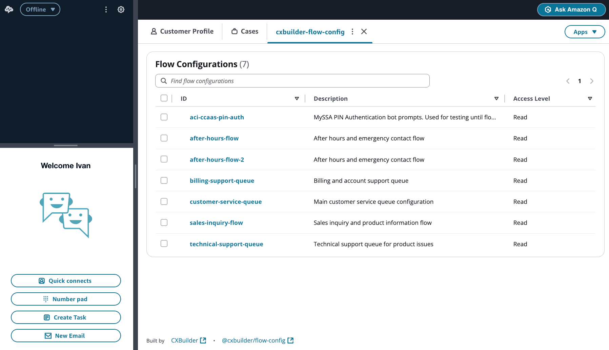
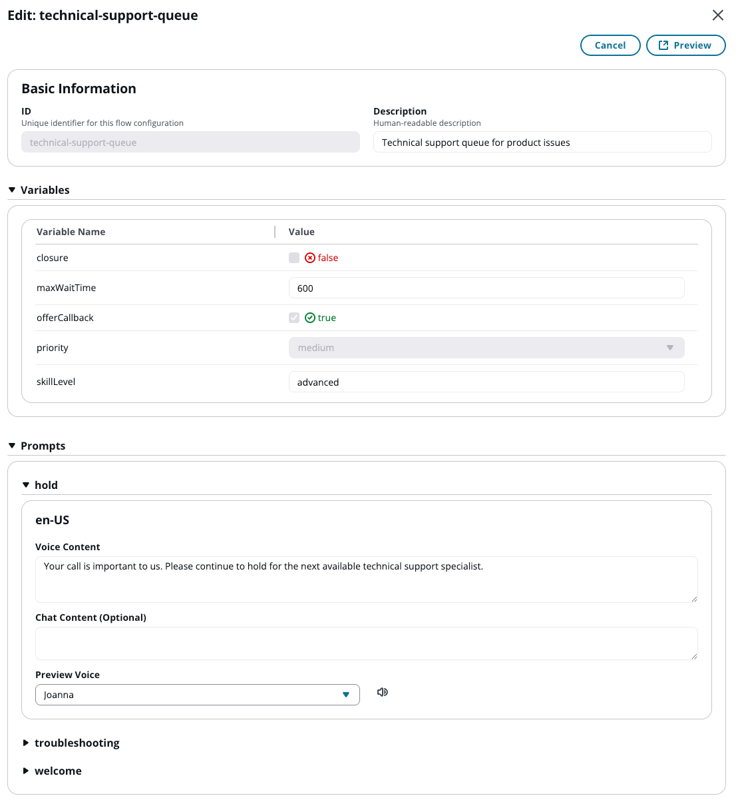
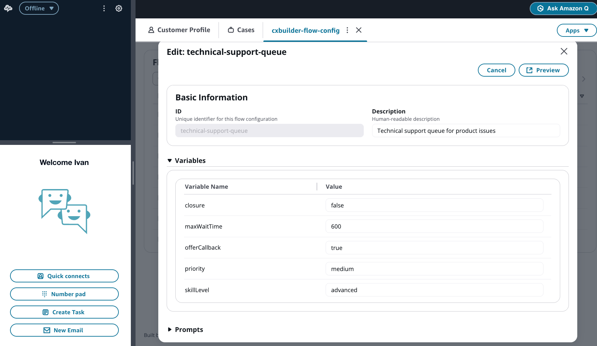
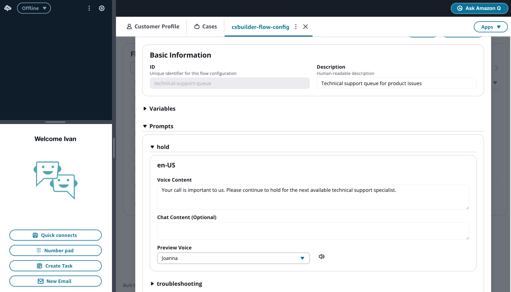

# FlowConfig User Guide - Read-Only User

This guide is for users with **Read** access who can view flow configurations but cannot make changes.

## Table of Contents

- [Getting Started](#getting-started)
- [Understanding Your Role](#understanding-your-role)
- [Viewing Flow Configurations](#viewing-flow-configurations)
- [Understanding Variables](#understanding-variables)
- [Understanding Prompts](#understanding-prompts)
- [Common Use Cases](#common-use-cases)

---

## Getting Started

### Accessing FlowConfig

1. Log into the **Amazon Connect Agent Workspace**
2. Click the **Apps** dropdown in the top right
3. Select **FlowConfig** (or your customized app name)

The application opens showing all flow configurations you have access to.

### Your Access Level

As a **Read-only** user, you can:

- **View** flow configurations assigned to you
- **See all variable values**
- **Read all prompt content** for all languages and channels
- **Preview voice prompts** using Amazon Polly
- **Search and filter** configurations

You **cannot**:

- Create new flow configurations
- Edit variable values
- Edit prompt content
- Delete flow configurations
- Add or remove variables or prompts

---

## Understanding Your Role

### Why Read-Only Access?

Read-only access is ideal for:

- **Auditors** reviewing configuration settings
- **Contact flow designers** verifying integration details
- **Quality assurance** teams reviewing customer-facing content
- **Stakeholders** monitoring current settings
- **Trainees** learning how configurations work

### What Are Flow Configurations?

Flow configurations contain settings and content that Amazon Connect contact flows use to interact with customers:

- **Variables**: Control flow behavior, routing, and features
- **Prompts**: Messages customers hear (voice) or see (chat)

---

## Viewing Flow Configurations

### Opening a Configuration

1. From the landing page, click on any flow configuration ID
2. The detail view shows:
   - **Basic Information**: ID and description
   - **Variables**: All variable names and current values
   - **Prompts**: All prompts with voice and chat content

### Searching for Configurations

Use the search box to find specific configurations:

1. Type any part of the ID or description
2. Results filter automatically as you type
3. Click a result to view its details

---

## Understanding Variables

Variables are key-value pairs that control contact flow behavior.

### Variable Display

Each variable shows:

- **Variable Name**: The identifier used in contact flows
- **Value**: The current setting

### Variable Types

You may see different types of variable values:

#### Text Variables

Simple text values displayed as-is.

**Example**:
- `skillLevel`: `advanced`

#### Number Variables

Numeric values for timeouts, limits, or counts.

**Example**:
- `maxWaitTime`: `600`

#### Boolean Variables

True/false values displayed with checkmarks and color indicators:
- ✓ **true** (green)
- ✗ **false** (red)

**Example**:
- `closure`: ✗ false
- `offerCallback`: ✓ true

#### Select Variables

Values chosen from a predefined list of options.

**Example**:
- `priority`: `medium` (other options might include low, high)

### What Variables Control

Common variable use cases:

- **Feature Flags**: Enable/disable features (`offerCallback`, `enableIVR`)
- **Emergency Settings**: Closure flags and alternate routing
- **Queue Settings**: Wait times, capacity limits
- **Routing Logic**: Priority levels, skill requirements
- **Business Rules**: Hours of operation, service availability

---

## Understanding Prompts

Prompts are messages delivered to customers.

### Prompt Structure

Each prompt may contain:

- **Multiple Languages**: Support for international customers
  - `en-US`: English (United States)
  - `es-US`: Spanish (United States)
  - `fr-CA`: French (Canada)
  - And more...

- **Two Content Types per Language**:
  - **Voice Content**: Played on phone calls
  - **Chat Content**: Displayed in chat conversations

### Viewing Prompt Content

1. Expand a prompt by clicking its name
2. Expand a language by clicking the language code
3. Read the voice and chat content

### Voice Content

Voice content is what customers hear when they call.

**Key Points**:
- May include SSML tags for enhanced speech (e.g., `<break time="1s"/>`)
- Designed to be spoken naturally
- Selected automatically based on customer's language preference

### Chat Content

Chat content is what customers see in chat conversations.

**Key Points**:
- Often customized to sound more natural in text
- If empty, voice content is used (with SSML removed)
- Example differences:
  - Voice: "Thank you for calling"
  - Chat: "Thank you for contacting us"

### Previewing Voice Prompts

To hear how a voice prompt sounds:

1. Locate the prompt and language you want to preview
2. Select a voice from the **Preview Voice** dropdown
3. Click the **speaker icon**
4. Listen to the preview using Amazon Polly

This shows you exactly what customers will hear.

---

## Common Use Cases

### Use Case 1: Auditing Configuration Settings

**Scenario**: Quality assurance team reviews monthly configurations.

**Actions**:
1. Access FlowConfig from Agent Workspace
2. Review each flow configuration assigned to you
3. Check variable values align with business requirements
4. Verify prompt content follows brand guidelines
5. Document any discrepancies for administrator review

### Use Case 2: Verifying Contact Flow Integration

**Scenario**: Contact flow designer confirms variable names and values before deploying a new flow.

**Actions**:
1. Open the flow configuration that will be used
2. Note all variable names (e.g., `closure`, `maxWaitTime`)
3. Verify expected values are present
4. Confirm prompt names match what the contact flow expects
5. Use this information to update contact flow Lambda calls

### Use Case 3: Content Review

**Scenario**: Marketing team reviews customer-facing prompts for brand consistency.

**Actions**:
1. Access FlowConfig
2. Review all prompts across configurations
3. Check language, tone, and branding
4. Verify multi-language content is accurate
5. Provide feedback to administrators for content updates

### Use Case 4: Training and Documentation

**Scenario**: New team member learning how the contact center is configured.

**Actions**:
1. Review flow configurations to understand operational settings
2. Read variable descriptions and values
3. Listen to prompt previews to understand customer experience
4. Document learnings for future reference

---

## Best Practices

### 1. Regular Review

- Periodically review configurations relevant to your role
- Stay informed about current settings
- Report discrepancies to your administrator

### 2. Documentation

- Take notes on configurations you frequently reference
- Document variable meanings for your team
- Create reference guides for common scenarios

### 3. Communicate Findings

- Report outdated or incorrect content to administrators
- Suggest improvements based on customer feedback
- Coordinate with Edit users on planned changes

### 4. Use Preview Feature

- Listen to voice prompts to understand customer experience
- Test different voices to hear variations
- Verify pronunciation of technical terms or proper nouns

---

## Understanding Access Levels

If you need to make changes to flow configurations, contact your administrator to request elevated access:

- **Edit Access**: Allows changing variable values and prompt content
- **Full Access**: Allows creating, editing, and deleting configurations

Your administrator will evaluate your request based on your role and responsibilities.

---

## Troubleshooting

### I can't see a configuration I need

- You may not have access to that configuration
- Contact your administrator to request access
- Verify you're searching with the correct ID or keywords

### Preview voice isn't working

- Check your network connection
- Refresh the page and try again
- Ensure the prompt contains text content

### I found incorrect information

- Document what you found (screenshot if possible)
- Contact the administrator or Edit user responsible for that configuration
- Do not attempt to modify it yourself

---

## Need Help?

- **Questions about configurations**: Contact your administrator or the team that manages flow configs
- **Technical issues**: Contact your IT support team
- **Access requests**: Contact your Amazon Connect administrator
- **Understanding variables**: Ask the contact flow designer or configuration owner

